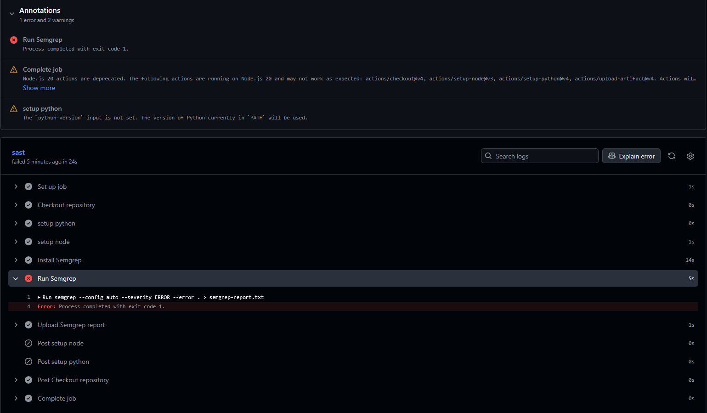
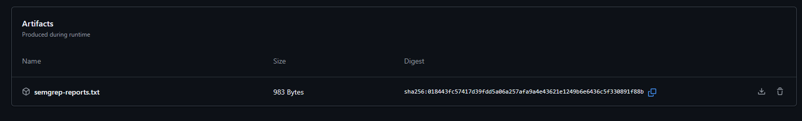

# Merkl Dev Ops Intern Challenge (SAST)

This application is a simple command-line user manager backed by a local SQLite database. The code intentionally includes vulnerable patterns to practice SAST analysis with Semgrep.

## Arborescence

```
Merkl-TC/
	main.py
	README.md
	task1-semgrep-output.txt
	task2-triage.txt
	task3-suppressed-output.txt
  resources/artifacts.png
  resources/summary.png
  resources/semgrep-report.txt
	.github/workflows/sast.yml
```

## Application Behavior

The script [main.py](main.py) provides a password-protected CLI menu (`MERKL`):

1. `Display Users`: displays all users from the database.
2. `Insert User`: adds a user (name + entered birth date).
3. `Delete User`: deletes a user by ID.
4. `Exit`: exits the program.

At startup, `database.db` is created if needed

## Run the Project

From the root of the `Merkl-TC` folder:

```bash
python3 main.py
```

Expected password:

```text
MERKL
```

# Analyse Semgrep



## Known Vulnerabilities (Intentional)

The code includes intentionally unsafe patterns:

- `eval(...)` on user-influenced data (code execution risk).
- SQL string concatenation in user deletion (SQL injection risk).
- Password in source code (not detected)

## Semgrep Report


### Semgrep scan output :
```
               
               
┌─────────────┐
│ Scan Status │
└─────────────┘
  Scanning 7 files tracked by git with 308 Code rules:
                                                                                                                        
  Language      Rules   Files          Origin      Rules                                                                
 ─────────────────────────────        ───────────────────                                                               
  <multilang>      44       7          Community     308                                                                
  python           84       1                                                                                           
  yaml              7       1                                                                                           
                                                                                                                        
                  
                  
┌────────────────┐
│ 1 Code Finding │
└────────────────┘
           
    main.py
   ❯❯❱ python.sqlalchemy.security.sqlalchemy-execute-raw-query.sqlalchemy-execute-raw-query
          ❰❰ Blocking ❱❱
          Avoiding SQL string concatenation: untrusted input concatenated with raw SQL query can result in SQL
          Injection. In order to execute raw query safely, prepared statement should be used. SQLAlchemy      
          provides TextualSQL to easily used prepared statement with named parameters. For complex SQL        
          composition, use SQL Expression Language or Schema Definition Language. In most cases, SQLAlchemy   
          ORM will be a better option.                                                                        
          Details: https://sg.run/2b1L                                                                        
                                                                                                              
           52┆ cursor.execute("DELETE FROM users WHERE id = " + user_id) # This line is vulnerable to SQL
               injection                                                                                 

                
                
┌──────────────┐
│ Scan Summary │
└──────────────┘
✅ Scan completed successfully.
 • Findings: 1 (1 blocking)
 • Rules run: 135
 • Targets scanned: 7
 • Parsed lines: ~100.0%
 • Scan was limited to files tracked by git
 • For a detailed list of skipped files and lines, run semgrep with the --verbose flag
Ran 135 rules on 7 files: 1 finding.

```

## Ressources

- [SQLite exemple](https://python.doctor/page-database-data-base-donnees-query-sql-mysql-postgre-sqlite)
- [.yml exemple](https://github.com/marketplace/actions/sast-action
)
- IA used for the README: Claude Haiku 4.5, in order to generate the content of the README quickly and efficiently, and to ensure that the structure and formatting are clear and consistent.

## Improvements that could be made to fix the vulnerabilities:

- Replace `eval` with a native age calculation (date arithmetic).
- Use parameterized queries for all SQL operations.
- Strictly validate user inputs (types, ranges, date format).

## Improvements that could be made to the code:

- Add error handling for database operations and user input.
- Add other WARNINGS from Semgrep

## Thoughts on identifying vulnerabilities
- The `eval` vulnerability is straightforward to identify due to the use of `eval` on user input.
- The SQL injection vulnerability is also identifiable by the string concatenation of user input in the SQL query.
- The hardcoded password can be detected by searching for string literals that match common password patterns